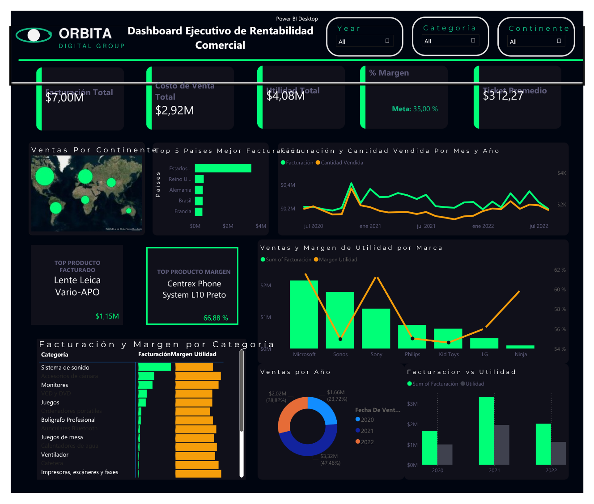

# **Orbita Digital Group — Commercial Profitability Executive Dashboard**
### **Data Analysis Project**

An end-to-end data analytics project: exploratory data analysis in Python, data cleaning and transformation in Power Query, and an executive Power BI dashboard designed to answer a question most sales dashboards miss, **is what sells the most also what's most profitable?**



## 📌 Business Problem

Orbita Digital Group is a global electronics and home goods distributor operating in 36 countries across 5 continents. Commercial leadership had visibility into total revenue by region, but no clear view of **profit margin** by brand, category, or country — leading the sales team to prioritize high-revenue products that were not necessarily the most profitable.

**Goal:** Design an executive dashboard combining sales volume with profitability, benchmarked against a business-defined margin target of **35%**, to support supplier negotiation and regional commercial strategy decisions.

## 🛠️ Tools & Tech Stack

| Stage | Tools |
|---|---|
| Exploratory Data Analysis | Python (Pandas) |
| Data cleaning & transformation | Power Query (M) |
| Data modeling & calculations | Power BI (quick measures, calculated columns) |
| Visualization | Power BI (single-page executive dashboard) |

## 📂 Dataset

- **Source file:** `Ventas_Tech.xlsx`
- **Records:** 22,419 rows (22,409 after removing 10 fully empty rows)
- **Period covered:** June 2020 – August 2022
- **Countries:** 36, across 6 continents
- **Brands:** 7 (Sony, LG, Philips, Sonos, Microsoft, Ninja, Kid Toys)
- **Categories:** 20
- **Unique products:** 444

| Field | Description |
|---|---|
| `Fecha De Venta` | Date of sale |
| `Ubicación` | Country + continent combined (split into two fields during cleaning) |
| `Producto` | Product name/model |
| `Marca` | Product brand |
| `Categoría` | Product category |
| `Precio Unidad` | Unit sale price |
| `Costo Unidad` | Unit cost |
| `Cantidad Vendida` | Units sold |
| `Facturación` | Revenue (Unit Price × Units Sold) |

**Calculated fields (added during cleaning):**
- `Costo de Venta` (Cost of Sale) = `Costo Unidad × Cantidad Vendida`
- `Utilidad` (Profit) = `Facturación − Costo de Venta`
- `País` / `Continente` = split from the original `Ubicación` field

## 🔍 Process

1. **EDA in Python** — diagnosed data quality without modifying the source file: checked nulls, duplicates, data types, unique categorical values, and value distributions to identify outliers.
2. **Cleaning in Power Query** — removed empty rows, split `Ubicación` into `País` and `Continente`, validated data types.
3. **Calculated columns in Power Query** — `Costo de Venta` and `Utilidad` added at the transaction level.
4. **Measures in Power BI** — quick measures used for ratio-based KPIs (`% Margin`, `Average Ticket`) that require dividing aggregated sums rather than row-level values.
5. **Dashboard design** — single-page executive layout with KPI cards, trend line, geographic and ranking visuals, brand/category comparisons, and interactive slicers (Year, Continent, Category).

## 💡 Key Insights

- **Overall profit margin is 58.29%**, well above the 35% business target — the company is structurally healthy in profitability terms.
- **Revenue is heavily concentrated in North America**, which accounts for the majority of total sales, followed by Europe and South America at a significant distance.
- **The United States alone generates ~$3.44M in revenue** — more than 6x the next country on the list (United Kingdom, ~$537K).
- **The highest-revenue product is not the highest-margin product.** The top-grossing item (a camera lens, ~$1.15M in revenue) is a completely different product from the highest-margin item — confirming the exact blind spot this dashboard was built to expose.
- **Microsoft is the strongest brand on both dimensions** — highest revenue (~$2.15M) *and* highest margin (61.7%), making it the brand with no revenue/profitability trade-off.
- **Sonos is a volume-margin mismatch case**: it's the #2 brand by revenue (~$1.79M) but has the *lowest* margin among all brands (54.9%) — a candidate for supplier renegotiation.
- **Profitability has been gradually declining year over year**: margin dropped from 60.1% (2020) to 58.9% (2021) to 55.8% (2022), even as revenue grew — a trend worth monitoring even though it remains above target.

## ✅ Recommendations

1. **Renegotiate supplier terms for Sonos.** It has strong sales volume but the weakest margin of all brands, even a small unit cost reduction would have an outsized impact on overall profitability given its volume.
2. **Investigate the year-over-year margin decline (2020→2022).** While still above the 35% target, a consistent downward trend across three years signals rising costs or discounting pressure that should be addressed before it crosses the threshold.
3. **Double down on North America and the U.S. specifically** for demand generation, given its outsized share of revenue — but pair this with margin monitoring per product line, since high volume alone (as seen with the top-revenue product) doesn't guarantee the best margin contribution.
4. **Use Microsoft as the benchmark brand** internally since it leads on both revenue and margin, its supplier terms and product mix could serve as a model for negotiating with underperforming brands like Sonos and Kid Toys (lowest margin overall, 54.6%).
5. **Expand the low-revenue, high-margin segment.** Products and brands with strong margins but low volume (opposite pattern from the top-revenue product) represent a growth opportunity if paired with targeted marketing investment.

## 📊 Dashboard Preview

The final dashboard includes:
- KPI cards: Total Revenue, Total Cost of Sale, Total Profit, % Margin (vs. 35% target), Average Ticket
- Revenue by continent (map)
- Top 5 countries by revenue
- Monthly historical revenue and sales volume trend
- Revenue and margin by brand (combo chart)
- Top product by revenue vs. top product by margin
- Revenue and margin by category (data bar table)
- Year-over-year comparison: revenue vs. profit


## 📁 Repository Structure

```
├── data/
│   ├── raw/
│   │      └── Ventas_Tech.xlsx 
│   └── processed/   
│          └── ventasTech_cleaned.csv   
├── docs
│   └── problem_statement.pdf
├── notebooks/
│   └── eda.ipynb               
├── powerbi/
│   └── orbita_dashboard.pbix         
├── images/
│    ├── dashboard_preview.png 
│    └── logo.png           
└── README.md
```
## 📃 Reproduce Notebook

1. Clone the Github repository
    * `git clone https://github.com/callmeerik/orbita_profitability_analysis.git`
2. Create a Python virtual enviroment
    * `python -m venv .venv`
3. Activate virtual enviroment
    * Windows: `.venv\Scripts\activate`
    * Linux/Mac: `source .venv/bin/activate`
4. Install dependencies
    * `pip install -r requiremnts.txt`

## 👤 Author

**Erik Carcelén**

Data Analyst | BI | Python

📍 Quito, Ecuador

🔗 [LinkedIn](https://www.linkedin.com/in/callmeerik/) · [GitHub](https://github.com/callmeerik)

*Portfolio Project*

